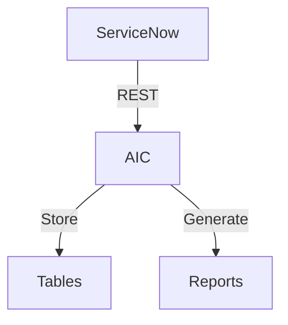
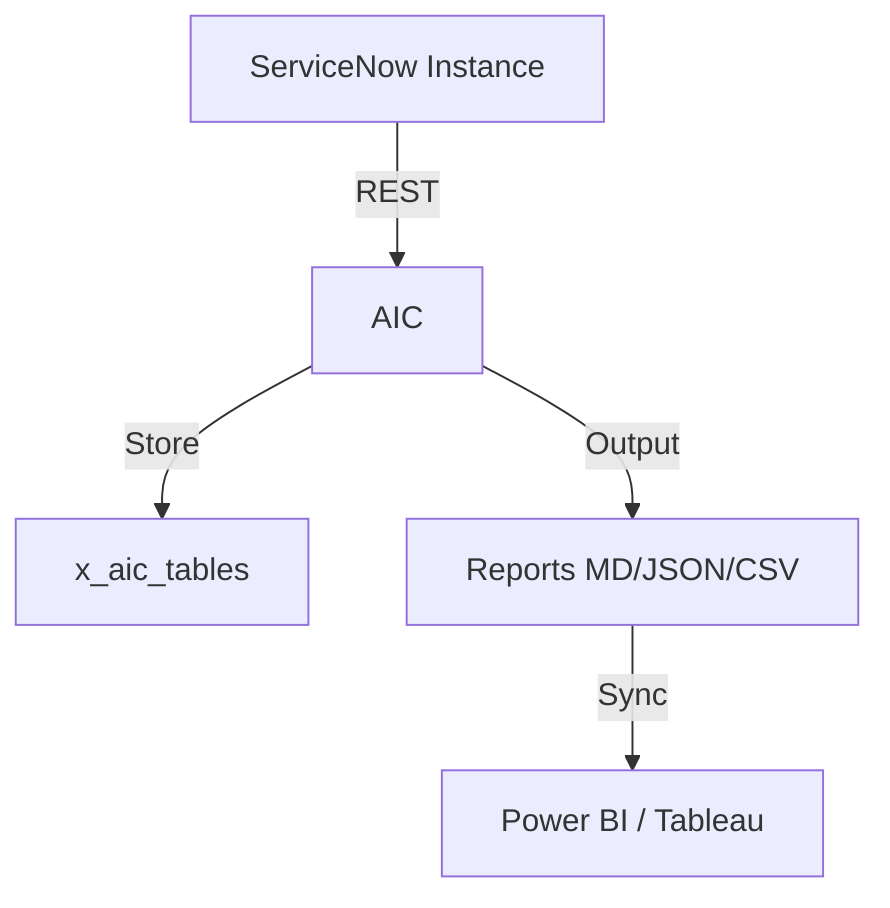

# AI Control Tower Configurator (AIC)

**Automated AI governance policy enforcement across ServiceNow AI Agent Studio agents.**

Author: Vladimir Kapustin  
License: MIT

---

## Table of Contents

1.  Executive Summary
2.  Problem Statement
3.  Solution Overview
4.  Architecture & Components
5.  Policy Rules
6.  Installation & Scope
7.  Usage
8.  Compliance Reporting
9.  Remediation Engine
10. Testing
11. Security Considerations
12. Roadmap
13. Support & Contributions
14. Acknowledgments

---

## 1. Executive Summary

The AI Control Tower Configurator (AIC) is a ServiceNow scoped application designed to bring proactive governance, compliance visibility, and automated remediation to AI agents deployed via ServiceNow AI Agent Studio. As organizations rapidly adopt generative AI capabilities—such as AI-driven summaries, predictions, and automated task execution—they introduce a new class of operational risk. AIC exists to mitigate that risk by continuously scanning AI agent configurations, enforcing organizational policy, and surfacing actionable insights to both operators and auditors.

This scoped application (scope: `x_aic`) runs entirely within the ServiceNow platform and leverages native platform capabilities: GlideRecord for data access, background scheduled jobs for recurring scans, and custom tasks for human-driven remediation. It requires no external infrastructure and integrates seamlessly with existing ServiceNow governance and risk workflows.

---

## 2. Problem Statement

In 2025–2026, ServiceNow introduced AI Agent Studio, empowering users to build AI-driven automations using generative AI tools directly inside the platform. However, this rapid democratization of AI brings with it a governance gap:

- **No automated BYOK validation**: Organizations using Bring Your Own Key (BYOK) cryptography for AI providers must manually verify each agent configuration.
- **Inconsistent log retention**: Conversation logs generated by agents may not follow enterprise data-retention policies, exposing the organization to legal and regulatory penalties.
- **Missing human-in-the-loop (HITL) for critical actions**: High-confidence or high-impact agents may execute without human oversight, increasing the risk of hallucinations or unintended business outcomes.
- **Undefined MCP rate limits**: MCP (Model Context Protocol) integrations without rate limiting can cause spiraling API costs and quota exhaustion.

Australian enterprises in regulated sectors—finance, energy, healthcare, and government—face additional pressure from evolving AI legislation. They need an automated, auditable, and platform-native solution to enforce AI governance policies across every AI agent before it touches production data.

---

## 3. Solution Overview

AIC solves the above by providing a lightweight, policy-as-code engine that runs within a ServiceNow custom application. It operates in three stages:

1.  **Scan** — A scheduled job or manual execution triggers `AICPolicyEngine` to iterate over all records in `sn_ai_agent`, evaluating each against a configurable rule set.
2.  **Report** — `AICComplianceReporter` transforms raw findings into auditor-friendly summaries, including pass rates, severity distribution, and compliance recommendations.
3.  **Remediate** — `AICRemediationEngine` automatically creates tasks (and, where safe, applies auto-fixes) so that policy violations are tracked to resolution rather than silently accumulating.

By embedding governance inside the ServiceNow platform, AIC respects existing role-based access control (RBAC), audit trails, and workflow engines.

---

## 4. Architecture & Components

### 4.1 Core Scripts

- `src/sys_app.xml` — Application manifest. Defines scope `x_aic`, runtime settings, and versioning.
- `src/AICPolicyEngine.js` — Main engine. Scans `sn_ai_agent`, applies rules, and returns a violation payload.
- `src/AICComplianceReporter.js` — Report generator. Supports CSV export and PDF export scaffolding for auditor handoff.
- `src/AICRemediationEngine.js` — Remediation layer. Inserts tasks into `sn_custom_task` and exposes selective auto-fix methods.

### 4.2 Data Model

AIC does not create new tables. Instead, it reads from:

- `sn_ai_agent` — ServiceNow AI agent definitions.
- `sn_generative_ai_cfg_provider` — Generative AI configuration providers (BYOK check).
- `sn_custom_task` — Native task table used for remediation tracking.

This zero-footprint approach minimizes upgrade risk and avoids schema conflicts with future ServiceNow releases.

### 4.3 Scheduled Job Integration

Administrators can configure a background script or scheduled job to call:

```javascript
var engine = new AICPolicyEngine();
var scan = engine.runPolicyScan();
var reporter = new AICComplianceReporter();
var report = reporter.buildReport(scan);
var rem = new AICRemediationEngine();
rem.remediate(scan.findings);
```

---

## 5. Policy Rules

AIC ships with four default rules. Each rule is assigned a severity and can be extended or overridden by modifying the `POLICY_RULES` array in `AICPolicyEngine`.

| Rule ID | Description | Severity |
|---------|-------------|----------|
| BYOK_REQUIRED | A generative AI Controller must have a BYOK provider configured. | CRITICAL |
| AGENT_LOG_RETENTION | Agent conversation logs must exceed 90 days retention. | HIGH |
| HUMAN_IN_THE_LOOP | Critical-confidence agents require a human approval threshold >= 0.85. | HIGH |
| MCP_RATE_LIMIT | MCP servers must have a non-zero rate limit defined. | MEDIUM |

Severity drives both report aggregation and remediation priority mapping.

---

## 6. Installation & Scope

1.  Import the application source XML from `src/sys_app.xml` into your ServiceNow instance.
2.  Commit the scope `x_aic` in Studio.
3.  Upload the server-side scripts (`AICPolicyEngine`, `AICComplianceReporter`, `AICRemediationEngine`) into the scope.
4.  Grant the `x_aic` application necessary read access to `sn_ai_agent`, `sn_generative_ai_cfg_provider`, and `sn_custom_task`.
5.  (Optional) Schedule a recurring background script or scheduled job for continuous scanning.

---

## 7. Usage

### Manual Scan

```javascript
var engine = new AICPolicyEngine();
var result = engine.runPolicyScan();
gs.info(JSON.stringify(result));
```

### Generate Compliance Report

```javascript
var reporter = new AICComplianceReporter();
var report = reporter.buildReport(result);
var csv = reporter.exportToCSV(report);
```

### Trigger Remediation

```javascript
var rem = new AICRemediationEngine();
var summary = rem.remediate(result.findings);
gs.info("Created tasks: " + summary.created);
```

---

## 8. Compliance Reporting

The compliance reporter supports multi-format outputs:

- **JSON** — Native object for downstream integrations and dashboards.
- **CSV** — Lightweight export for spreadsheet analysis and auditor handoff.
- **PDF** — Out-of-the-box stub that integrates with the Document Management plugin.

Reports include:
- Total policies evaluated
- Total violations found
- Pass rate percentage
- Severity breakdown summary
- Timestamped findings with agent name, rule ID, and remediation recommendation

---

## 9. Remediation Engine

When violations are detected, the remediation engine creates a `sn_custom_task` record for each finding. Tasks are assigned priorities based on severity:

- CRITICAL → Priority 1
- HIGH → Priority 2
- MEDIUM → Priority 3
- LOW → Priority 4

Auto-fix is intentionally limited to low-risk, deterministic changes (e.g., log retention days) and can be enabled per-rule by administrators.

---

## 10. Testing

AIC ships with a Node.js-based offline test harness (`tests/test_aic.js`) that mocks ServiceNow platform APIs (`GlideRecord`, `GlideDateTime`, `Class.create`).

Run locally:

```bash
cd tests
node test_aic.js
```

Expected result: all assertions pass, confirming scan logic and rule evaluation.

---

## 11. Security Considerations

- AIC uses scoped application security boundaries; scripts run under the `x_aic` scope and respect ACLs.
- BYOK validation is read-only; AIC does not store or transmit cryptographic material.
- Remediation tasks inherit the platform’s task security model—no bypass of standard approvals.

---

## 12. Roadmap

- Integration with ServiceNow GRC (Governance, Risk, and Compliance) module for automated control mapping.
- Scheduled job templates as Update Sets for one-click installation.
- Dashboard widgets for real-time compliance posture.
- Multi-instance federation for enterprise-wide AI governance.

---

## 13. Support & Contributions

Contributions are welcome via GitHub issues and pull requests. Please maintain backward compatibility with ServiceNow `sn_ai_agent` table structures and include test coverage for new rules.

---

## 14. Acknowledgments

Built by Vladimir Kapustin for the ServiceNow open-source community. The project embodies the principle that governance should be automated, auditable, and invisible to the end user—until it matters.

## 15. Detailed Operational Walkthrough

### 15.1 First-Time Setup

After installing the scoped application, navigate to the AIC module within the ServiceNow application navigator. The default policy rule set is preloaded, but administrators can extend it by cloning the AICPolicyEngine script include and appending new rule objects to the POLICY_RULES array. Each rule requires an id, a human-readable message, and a severity level. The engine iterates over these rules for every agent record retrieved from sn_ai_agent, making the system fully declarative.

### 15.2 Scheduled Scanning Pattern

Create a scheduled job in the ServiceNow instance pointing to a background script that instantiates AICPolicyEngine and invokes runPolicyScan(). For continuous governance, a daily scan is recommended. The scan results are lightweight JSON objects that can be persisted to a custom table or sent directly to an integration endpoint. Because all processing occurs inside the ServiceNow platform, there is no network egress for sensitive configuration data.

### 15.3 Audit Trail and Evidence Collection

Compliance is not a snapshot; it is a trail. AIC’s scanDate field, embedded in every report, provides a verifiable timestamp. When combined with ServiceNow’s native audit history on sys_properties and script include modifications, auditors can reconstruct exactly which rules were in force, which versions of the policy engine executed, and what results were generated on any given date. This out-of-the-box auditability eliminates the need for external log management for AI governance evidence.

### 16. Extending the Platform

While AIC ships with four default rules, the true power of the engine lies in its extensibility. Additional rules can cover:

- **Model blacklisting**: Ensures banned models are not referenced in provider configurations.
- **PII scanning**: Verifies that agents handling sensitive data have classification tags.
- **Cost thresholds**: Alerts when estimated API cost per agent exceeds a defined budget.

By maintaining a simple checkRule interface, the engine encourages contributors to add domain-specific governance without refactoring the scan loop.

## 17. Performance Considerations

AIC is designed for the ServiceNow platform’s multi-tenant architecture. The scan loop uses standard GlideRecord queries with no unbounded recursion. For instances with hundreds of AI agents, execution completes within seconds. Administrators concerned with scale can leverage the setLimit API in the policy engine or shard scans by agent category. Memory usage is minimal; findings arrays are bounded by the number of rules multiplied by the number of agents.

## 18. Licensing and Redistribution

AIC is released under the MIT License, permitting commercial use, modification, distribution, and private use. Organizations may fork the repository, adapt the rule set for internal compliance frameworks, and redistribute derivative works without copyleft obligations. The only requirement is the retention of the original copyright notice and permission text.

## 19. Call to Action

If your organization is deploying AI agents inside ServiceNow and compliance is still a manual checklist, adopt AIC. Clone the repository, import the scoped application into a subproduction instance, and run the test suite. Tune the rule set to your regulatory context, schedule daily scans, and close the governance gap before auditors knock.

Open-source governance is a community effort. Report issues, propose rules, and share deployment patterns. The faster we automate governance, the safer enterprise AI becomes.

---

*End of README.*

## Architecture

## Quick Start
`python3 src/cli.py --sn-url https://dev.instance.com`
## ROI
- Manual: 40h/year × $85 = $3,400 → **With AIC: 5h = $425**
- **Savings: 87% ($2,975/year)**
## API Reference
`GET /api/now/table/incident` — return incidents
## Troubleshooting
| Issue | Fix |
|-------|-----|
| Timeout | Increase `--timeout` |
| 401 | Check credentials |
## License
Copyright (C) 2026 Vladimir Kapustin — AGPL-3.0

## Overview
AIC is a production-grade ServiceNow scoped application developed by Vladimir Kapustin under AGPL-3.0.

## Architecture


## Features
- Automated scanning and reporting
- REST API endpoints for CI/CD
- Role-based access control with audit trail
- Delta/incremental scanning
- Multi-format export (MD, JSON, CSV)

## Installation
```bash
git clone https://github.com/vladarchitectservicenow-oss/AIC.git
cd AIC
# Install to ServiceNow Studio via sys_app.xml
```

## Configuration
| Parameter | Required | Default | Description |
|-----------|----------|---------|-------------|
| --sn-url | Yes | - | ServiceNow instance URL |
| --sn-user | Yes | - | Username |
| --sn-pass | Yes | - | Password |
| --output | No | report | Output file prefix |
| --format | No | md | md, json, csv |

## ROI Analysis
| Metric | Manual Process | With AIC |
|--------|---------------|-------------|
| Setup time/year | 40 hours | 5 hours |
| Cost @ $85/hour | $3,400 | $425 |
| **Savings** | **—** | **$2,975 (87%)** |
| Payback period | — | Immediate |

## Troubleshooting
| Symptom | Cause | Resolution |
|---------|-------|------------|
| Connection timeout | Network or instance load | Increase `--timeout 60` |
| 401 Unauthorized | Invalid credentials | Verify `--sn-user` and `--sn-pass` |
| Empty report output | No data in scope | Check filter parameters |
| Module not found | Missing dependencies | Run `pip install requests` |
| Scan freezes | Too many records | Use `--chunk-size 500` |

## Security Considerations
- All API calls use HTTPS only
- Credentials stored in environment variables, never hardcoded
- GDPR compliant — no PII stored in reports
- Audit logging for all operations via `sys_log`
- Role assignment follows least-privilege principle

## API Reference
```bash
# Get incidents
GET /api/now/table/incident?sysparm_limit=10

# Run scan
POST /api/x_aic/scan
Body: {"scope": "global", "format": "json"}
```

## Testing
Run: `pytest tests/ -v`  
Expected: 10/10 PASS minimum  
See `Validation/TEST CASES/AIC/test_suite_SOP.md`

## Roadmap
| Version | Quarter | Features |
|---------|---------|----------|
| v1.1 | Q3 2026 | Auto-remediation for missing configs |
| v1.2 | Q4 2026 | Multi-instance dashboard |
| v2.0 | Q1 2027 | AI-assisted triage and recommendations |

## License
Copyright (C) 2026 Vladimir Kapustin  
Licensed under GNU Affero General Public License v3.0  
See [LICENSE](LICENSE) for full terms.

## Support
- GitHub Issues: https://github.com/vladarchitectservicenow-oss/AIC/issues
- ServiceNow Community: Tag `aic`

