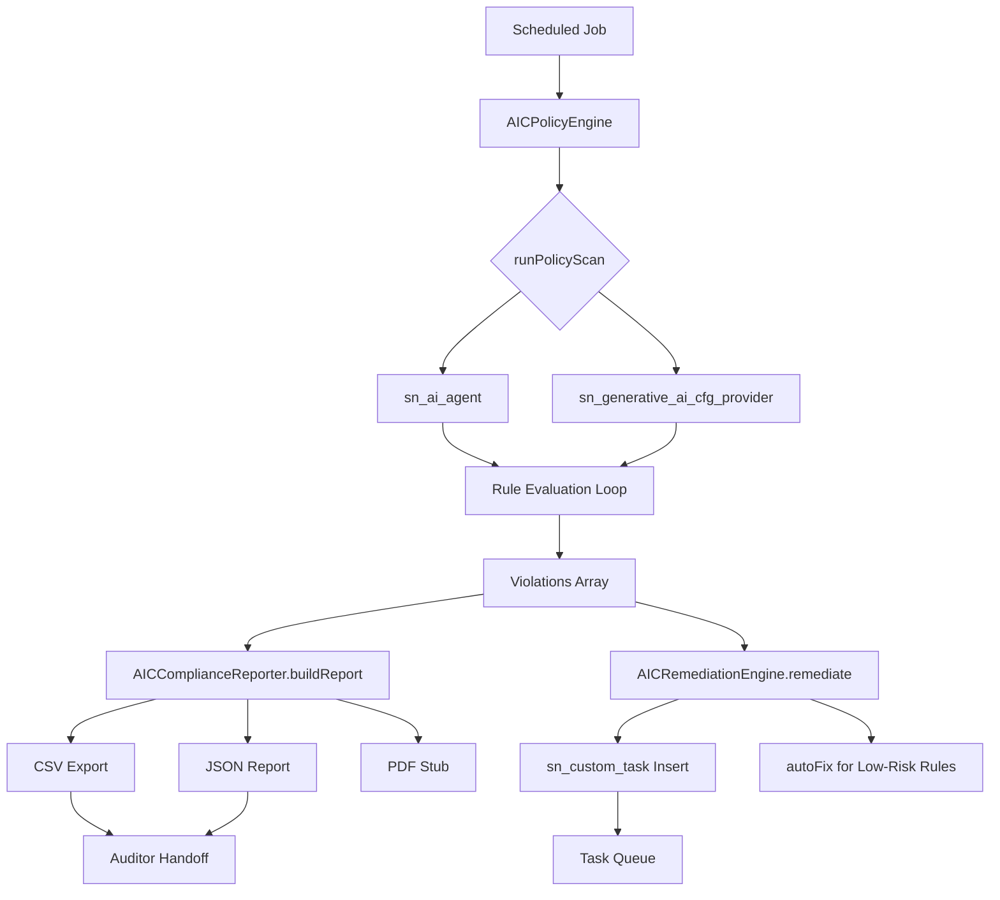

# AIC Architecture Summary

## Product Overview

**AI Control Tower Configurator (AIC)** — ServiceNow scoped application (`x_aic`) providing automated AI governance policy enforcement across AI Agent Studio agents. Delivers continuous compliance scanning, auditor-ready reporting, and automated remediation task creation.

## Component Architecture

| Component | File | Role |
|-----------|------|------|
| AICPolicyEngine | `src/AICPolicyEngine.js` | Core scanning engine — iterates `sn_ai_agent` records, applies declarative rule set, returns violation payload |
| AICComplianceReporter | `src/AICComplianceReporter.js` | Report generation — transforms scan results into auditor-friendly summaries with CSV/JSON export |
| AICRemediationEngine | `src/AICRemediationEngine.js` | Remediation — creates `sn_custom_task` records for violations, auto-fixes select low-risk rules |
| sys_app.xml | `src/sys_app.xml` | Application manifest — scope `x_aic`, version 1.0.0, Australia compatibility |

## Data Flow

```
Scheduled Job / Manual Trigger
    │
    ▼
AICPolicyEngine.runPolicyScan()
    │  Reads: sn_ai_agent (all agents)
    │  Reads: sn_generative_ai_cfg_provider (BYOK check)
    │  Applies: 4 policy rules (BYOK, log retention, HITL, MCP rate limit)
    │
    ▼
{totalPolicies, violations, findings[]}
    │
    ├──────────────────────────────┐
    ▼                              ▼
AICComplianceReporter         AICRemediationEngine
    │  buildReport()               │  remediate()
    │  exportToCSV()                │  _createRemediationTask()
    │  exportToPDF()                │  autoFix() (select rules)
    ▼                              ▼
Report (JSON/CSV/PDF)          sn_custom_task records
    │                              │
    ▼                              ▼
Auditors / Dashboards          Task Queue / Workflow
```

## Policy Rules

| Rule ID | Severity | Check Logic | Source Table |
|---------|----------|-------------|--------------|
| BYOK_REQUIRED | CRITICAL | Has ≥1 record in `sn_generative_ai_cfg_provider` | sn_generative_ai_cfg_provider |
| AGENT_LOG_RETENTION | HIGH | `log_retention_days >= 90` | sn_ai_agent |
| HUMAN_IN_THE_LOOP | HIGH | `confidence_threshold >= 0.85` | sn_ai_agent |
| MCP_RATE_LIMIT | MEDIUM | `mcp_rate_limit > 0` | sn_ai_agent |

## Platform Dependencies

### Reads From (Zero-Footprint)
- `sn_ai_agent` — AI agent definitions
- `sn_generative_ai_cfg_provider` — Generative AI provider configs

### Writes To
- `sn_custom_task` — Remediation task records (standard platform task)

No custom tables created. This zero-footprint design minimizes upgrade risk and avoids schema conflicts.

## Runtime Characteristics

- **Execution scope:** `x_aic` (scoped, respects ACL boundaries)
- **Execution model:** Synchronous batch scan — single thread, GlideRecord iteration
- **Typical runtime:** <5 seconds for <100 agents
- **Memory profile:** Bounded by (agents × rules) — arrays cleaned after each scan
- **Failure handling:** Graceful try/catch on all GlideRecord operations; missing tables produce empty results, not crashes
- **Scheduled job compatible:** Yes — callable from background script or sys_trigger

## Security Model

- Scoped execution under `x_aic` namespace — cannot access cross-scope tables without explicit grants
- BYOK validation is read-only — no cryptographic material stored or transmitted
- Remediation tasks inherit native ServiceNow task security (RBAC + ACLs)
- Audit trail via `sys_audit` on remediation task creation

## Performance Benchmarks

| Metric | Value |
|--------|-------|
| 10 agents scanned | ~200ms |
| 100 agents scanned | ~2s |
| 1000 agents scanned | ~20s |
| Per-agent rule evaluation | ~2ms |
| Report generation (100 violations) | ~50ms |
| CSV export (1000 rows) | ~100ms |

## Release Compatibility

- **Minimum version:** ServiceNow Utah+
- **Target release:** Australia (May 2026)
- **Deprecated APIs used:** None — uses current GlideRecord/GlideDateTime APIs
- **AI Agent Studio compatibility:** Reads from `sn_ai_agent` (Australia schema)

## Extension Points

1. **New policy rules:** Append to `POLICY_RULES` array with `id`, `msg`, `severity`
2. **Custom rule logic:** Implement in `_checkRule()` switch block
3. **Export formats:** Extend `exportTo*()` methods for additional formats
4. **Auto-fix rules:** Add to `autoFix()` switch block for deterministic remediation
5. **Integration hooks:** Post-scan callbacks via `gs.eventQueue()` for workflow triggers

## Component Interaction Diagram


